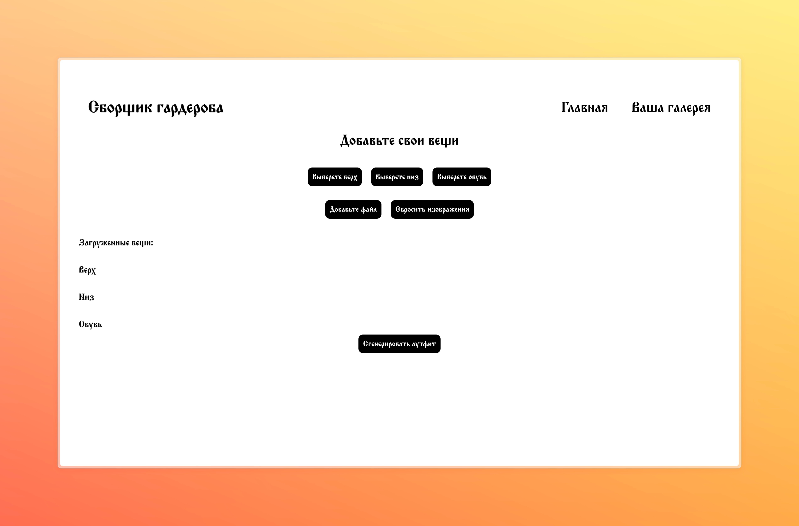
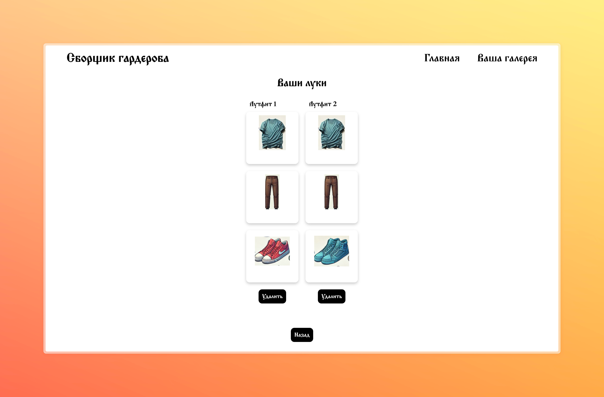

# 👕 Outfit Generator (Генератор аутфитов)

**Outfit Generator** — это веб-приложение на React, которое позволяет пользователям загружать свои вещи, генерировать случайные образы и сохранять их в галерею.

## 🚀 Функционал
- Загрузка изображений одежды в три категории: **верх, низ, обувь**.
- Автоматическое сохранение загруженных изображений в `localStorage`.
- Генерация случайного аутфита из загруженных вещей.
- Возможность **сохранить** аутфит в галерею и **просматривать сохраненные образы**.
- Кнопка **"Сбросить изображения"**, если нужно очистить загруженные вещи.
- Возможность **удалять сохраненные аутфиты** из галереи.

